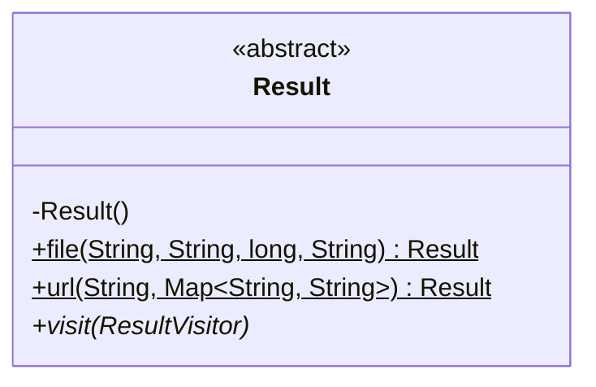

# OutputProvisioner

<!-- TODO: Document the rest of this class! -->

## OutputProvisioner.Result

The `Result` internal class stores metadata about successful provisioning.

[OutputProvisioner](../src/main/java/ca/on/oicr/gsi/vidarr/OutputProvisioner.java) uses the 
[Visitor pattern](https://en.wikipedia.org/wiki/Visitor_pattern) to provide extensibility in the types of 
information that a Provisioner may provision. Therefore, this abstract class is not meant to be extended outside of
itself - the private constructor prevents it. `new` implementations of Result are found within in the bodies of 
`file()`, `url()`, and any other new static methods that may be added in future development. The only requirement for 
these internal implementations is `visit`, which takes a `ResultVisitor` and passes parameter values to its
corresponding type method. 

`public static Result file(String, String, long, String)` enables a `ResultVisitor` to process a file with the specified
metadata:
  * String storagePath
  * String checksum
  * String checksumType
  * long size
  * String metatype

`public static Result url(String, Map<String, String>)` enables a `ResultVisitor` to process a record represented by
a URL with an arbitrary set of metadata attached:
  * String url
  * Map<String, String> labels containing arbitrary metadata

For extending the types of records a `ResultVisitor` may process, define a new method in both `Result` and all 
`ResultVisitor` implementations named after the type and taking in the appropriate identifier and metadata. The method
in `Result` should have a `public static Result` signature and return a `new Result` with an inline implementation of:

`public abstract void visit(ResultVisitor)` which passes the identifier and metadata to the `ResultVisitor`.
Example: 
```java
public static Result file(String storagePath, String checksum, String checksumType, long size, String metatype) {
    return new Result() {
        @Override
        public void visit(ResultVisitor visitor) {
          visitor.file(storagePath, checksum, checksumType, size, metatype);
        }
      };
    }
```
