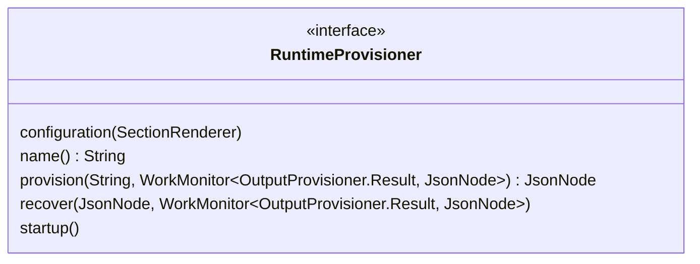

# RuntimeProvisioner Services

RuntimeProvisioner is part of the Vidarr plugin API. For an overview, please refer to the 
[Vidarr Plugin Developer's Guide](../../plugin-guide.md).

RuntimeProvisioners are one of the three types of Provisioner service defined by the plugin API. Implementations of this
interface are responsible for collecting metadata generated _during_ a workflow run, and storing the metadata via an 
[OutputProvisioner](./OutputProvisioner.md).Result.

Plugins providing the RuntimeProvisioner service must implement 
[RuntimeProvisioner](../src/main/java/ca/on/oicr/gsi/vidarr/RuntimeProvisioner.java) and 
[RuntimeProvisionerProvider](../src/main/java/ca/on/oicr/gsi/vidarr/RuntimeProvisionerProvider.java). 

For ease of use,
[BaseJsonRuntimeProvisioner](../src/main/java/ca/on/oicr/gsi/vidarr/BaseJsonRuntimeProvisioner.java) is provided, which
is an abstract class which implements RuntimeProvisioner using [Jackson](https://github.com/FasterXML/jackson) to 
serialize and deserialize input and state. Developers may choose to extend this class to take advantage of this
standardized behaviour.

## RuntimeProvisioner

[RuntimeProvisioner](../src/main/java/ca/on/oicr/gsi/vidarr/RuntimeProvisioner.java) is an interface which must be 
implemented by the class providing the service logic. Implementation
classes are named `(ExternalService)RuntimeProvisioner`. Like the other Provisioner interfaces, 
RuntimeProvisioner uses [jackson-databind](https://github.com/FasterXML/jackson-databind) to map information taken from
the server's `(environment).vidarrconfig` file to member non-static fields. Use the `@JsonIgnore` annotation to prevent
this mapping from happening, if necessary.

`void configuration(SectionRenderer)`: Use the `SectionRenderer` object from the `status` module of oicr-gsi's 
[server-utils](https://github.com/oicr-gsi/server-utils) which has been passed in to write configuration information to
the Vidarr status page in the web interface. This method is called in 
[vidarr-server's Main.java](../../vidarr-server/src/main/java/ca/on/oicr/gsi/vidarr/server/Main.java) when building the
status page.

`String name()`: define a unique name for this service. This name is used when:
  * `recover`ing operations after downtime
    * and therefore, will be used when journaling state to the database
  * calling all applicable RuntimeProvisioners on a new workflow run in
[BaseProcessor.Phase3Run](../../vidarr-core/src/main/java/ca/on/oicr/gsi/vidarr/core/BaseProcessor.java)

`JsonNode provision(String, WorkMonitor<OutputProvisioner.Result, JsonNode>)`: Start the provisioning process. 
  * the value of the `String` parameter will be the URL provided by
[WorkflowEngine.Result](../src/main/java/ca/on/oicr/gsi/vidarr/WorkflowEngine.java)'s `workflowRunUrl()`
  * The [WorkMonitor](./WorkMonitor.md) parameter is used for scheduling tasks and journaling the output
of the provisioning process. <!-- TODO: right? -->
    * The first generic type is the output type used by the WorkMonitor. This means when calling `monitor.complete()`, 
etc, use the static methods `Result.file()` or `Result.url()` to create new Result records. See
[OutputProvisioner](./OutputProvisioner.md).Result for more information.
    * The second generic type is the format of the state records
  * The return value is used by a WrappedMonitor in
[BaseProcessor.Phase3Run](../../vidarr-core/src/main/java/ca/on/oicr/gsi/vidarr/core/BaseProcessor.java) to serialize
the journal to the database <!-- TODO: I think? -->

`void recover(JsonNode, WorkMonitor<OutputProvisioner.Result, JsonNode>)`: Every plugin journals its state to the
database. In the case that the Vidarr server stops and is restarted, the `recover()` method on every plugin is called. 
This method should be able to rebuild its full state from the `JsonNode` it receives from the database (containing the 
journal) in the first parameter. It should then schedule the appropriate next step with the `WorkMonitor`, calling using
the static methods `Result.file()` or `Result.url()` to create new Result records as appropriate. See
[OutputProvisioner](./OutputProvisioner.md).Result for more information.

`void startup()`: Method called on server startup to initialize the plugin. Actual reading of configuration information
does not need to happen due to jackson-databind. Configuration information is used here to do any setup required,
e.g. passing username and password from configuration information to an SSH client to initialize a connection. If any 
configuration information is invalid, the developer must purposefully throw a RuntimeException to prevent server 
startup.

## RuntimeProvisionerProvider
<!-- TODO: Make a Mermaid diagram for RuntimeProvisionerProvider once nested generics are supported -->
The [RuntimeProvisionerProvider](../src/main/java/ca/on/oicr/gsi/vidarr/RuntimeProvisionerProvider.java) interface
is used to instantiate the corresponding Provisioner. It can be implemented as a separate class or by a method with
signature `public static OutputProvisionerProvider provider()` in the corresponding Provisioner. 
<!-- TODO: how does that work? -->

This class is used by the ServiceLoader to discover RuntimeProvisioners through the module system. The 
`module-info.java` must specify which class `provides` RuntimeProvisionerProvider.

`Stream<Pair<String, Class<? extends RuntimeProvisioner>>> types()`: provides the names and classes of the services
this plugin provides. 